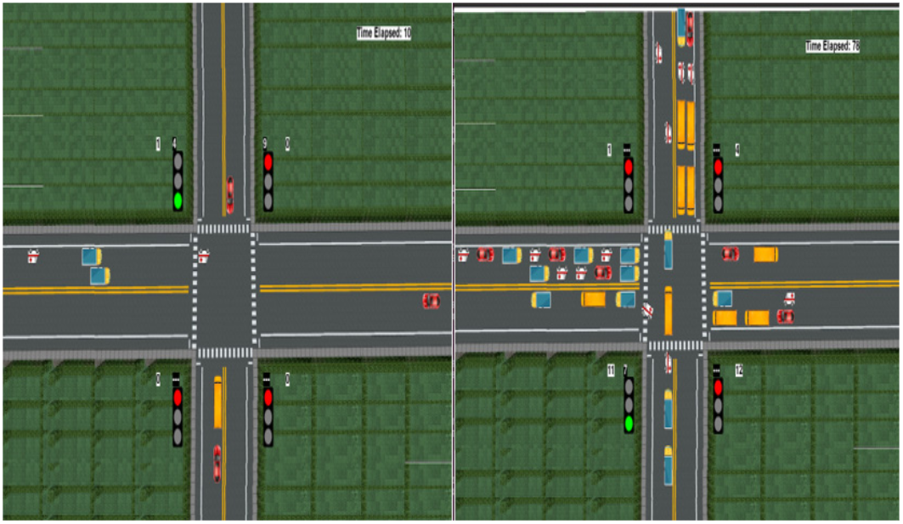
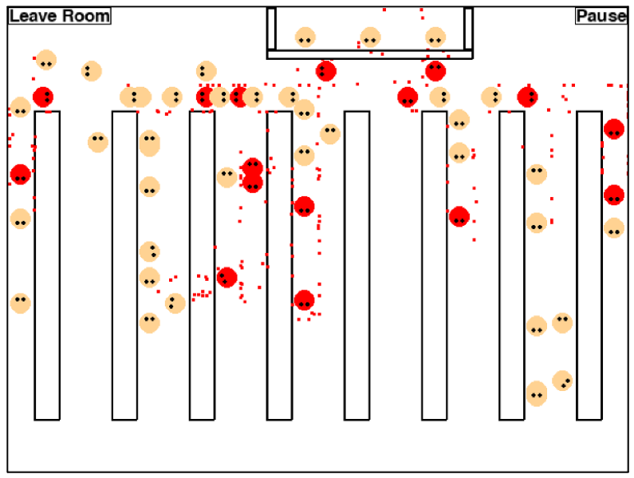

# Wizualizacja za pomocą biblioteki PyGame

Pygame to zestaw modułów zaprojektowany do tworzenia gier w języku Python. Jest to biblioteka open-source, która zapewnia narzędzia niezbędne do tworzenia multimedialnych aplikacji, w tym gier 2D i interaktywnych aplikacji graficznych. Pygame bazuje na bibliotece SDL (Simple DirectMedia Layer), co umożliwia przenośność kodu na różne platformy.

## Przykładowe zastosowania biblioteki *PyGame*

Wszystkie powyższe przykłady wykorzystyją bibliotekę PyGame w celu wizualizacji oraz prezentacji danych.
Ze względu na swoją prostotę PyGame okazał się tutaj świetnym wyborem.

- [A Vehicle Density Estimation Traffic Light Control System Using a Two-Dimensional Convolution Neural Network](https://www.researchgate.net/publication/376625157_A_Vehicle_Density_Estimation_Traffic_Light_Control_System_Using_a_Two-Dimensional_Convolution_Neural_Network)

- [Analogical Study of Activation Concept in Neural Networks with Neat-Python Module](https://www.researchgate.net/publication/371069611_Analogical_Study_of_Activation_Concept_in_Neural_Networks_with_Neat-Python_Module)
- [Assessing the Impact of Mask Usage on COVID-19 Transmission Using a Computer Simulation](https://www.researchgate.net/publication/352266402_Assessing_the_Impact_of_Mask_Usage_on_COVID-19_Transmission_Using_a_Computer_Simulation)

